# Práctica: Flujo de Trabajo Colaborativo con Git y GitFlow
**Módulo:** Proyecto Intermodular II  
**Autor Principal:** Pedro Elías Simón Velásquez (`PESV2526`)  
**Colaborador:** `PESV2526-colab`  
**Repositorio Remoto:** [github.com/PESV2526/practicasGit](https://github.com/PESV2526/practicasGit)  
**Versión / Tag:** `v1.0.0`

---

**Adaptación del flujo de trabajo a la metodología GitFlow**

- **Estructura de ramas:** En cumplimiento de la metodología GitFlow, se definen
    dos ramas de ciclo de vida infinito:
       o main: Rama de producción, reservada exclusivamente para releases
          estables y etiquetadas (v1.0.0).
       o develop: Rama centralizadora del desarrollo activo e integración.
- **Ramas de soporte:** La refactorización del colaborador se canalizó bajo el modelo
    _feature branch_ (feature-colab), integrándose mediante Pull Request y
    completando el ciclo de validación antes de consolidar la versión final en main.

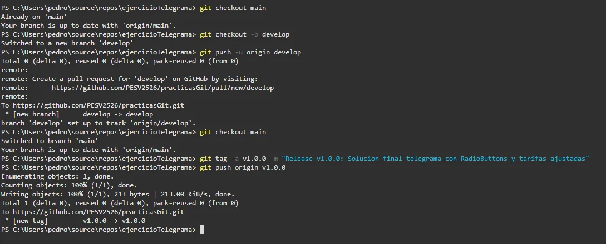
_Adaptación del flujo de trabajo_

**Usuario Principal PESV**

**Incidencia 1: Detección y eliminación de repositorio Git fantasma en directorio
superior**

**1. Descripción del problema**

Al comprobar el estado del área de trabajo con git status antes de realizar el primer commit
de la solución ejercicioTelegrama, Git comenzó a listar advertencias de denegación de
acceso en carpetas del sistema y mostró como archivos no rastreados ( _untracked_ )
elementos situados fuera del proyecto (../../../), intentando incluir la totalidad del perfil de
usuario de Windows (C:\Users\pedro).


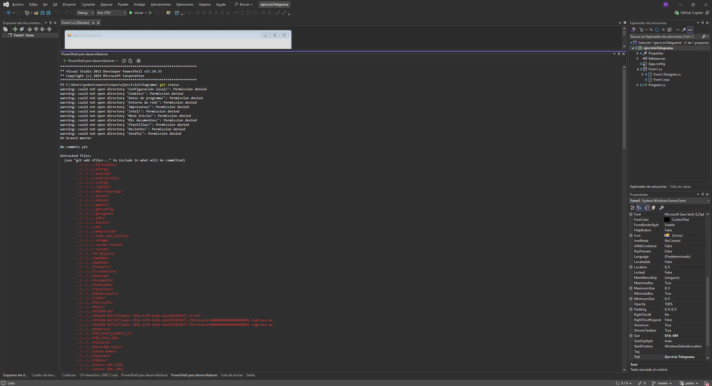
_Salida de PowerShell mostrando las advertencias de "Permission denied" y
los archivos no rastreados con prefijo ../../../)_

**2. Causa técnica**

Git resuelve el árbol de control buscando de forma recursiva hacia arriba en la jerarquía
de carpetas hasta encontrar un directorio .git. En este caso, existía una carpeta .git residual
en la raíz del usuario (C:\Users\pedro\.git), provocada por una inicialización previa
accidental. En consecuencia, Git interpretó todo el disco de usuario como el repositorio
raíz, ignorando el contexto local del ejercicio.


**3. Resolución aplicada**
    1. **Auditoría de rutas con PowerShell:** Se verificó la existencia de directorios .git
       en las carpetas superiores mediante el cmdlet Test-Path:
          _Test-Path C:\Users\pedro\.git_

El comando devolvió True, confirmando el origen del problema.

2. **Purga del repositorio incorrecto:** Se eliminó de forma forzada la carpeta de
    metadatos de Git de la raíz del usuario:
       _Remove-Item -Path C:\Users\pedro\.git -Recurse -Force_
3. **Inicialización y vinculación del repositorio local del proyecto:** Al quedar la
    carpeta ejercicioTelegrama desprovista de control de versiones, se inicializó
    correctamente el repositorio en el directorio raíz del proyecto y se vinculó al
    remoto de GitHub:
       _git init
git remote add origin https://github.com/PESV2526/practicasGit.git_

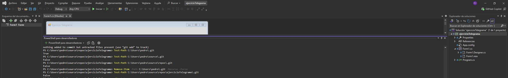
_Comandos de PowerShell con Test-Path, borrado de la carpeta .git y nuevo
git status acotado al proyecto_


**Incidencia 2: Limpieza de artefactos y configuración de exclusiones (.gitignore)**

**1. Descripción del problema**

Tras inicializar el repositorio local, git status mostró carpetas temporales de compilación
y configuración de Visual Studio (.vs/ y obj/) pendientes de ser versionadas.

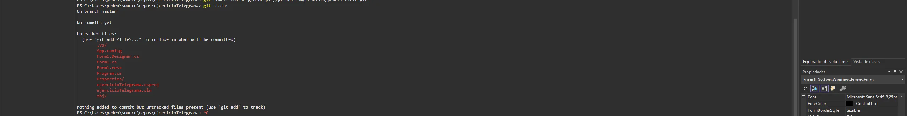
_Salida de git status con .vs/ y obj/ en Untracked files_

**2. Causa técnica**

El entorno local carecía de un archivo .gitignore adaptado al ecosistema .NET / Visual
Studio, lo que provocaría subir al repositorio remoto binarios temporales y
configuraciones de entorno volátiles innecesarias.

**3. Resolución aplicada**

Se generó una plantilla de .gitignore específica para .NET que omite automáticamente
directorios de compilación (bin/, obj/) y metadatos de la IDE (.vs/). Se comprobó que git
status únicamente mostraba los ficheros de código fuente (.cs), recursos (.resx),
configuración (App.config, Properties/), el archivo de solución (.sln), el archivo de
proyecto (.csproj) y el .gitignore.

A continuación, se preparó y realizó el commit inicial de la solución base:

```
git add.
git commit -m "Primer commit: Solucion inicial y estructura base"
```
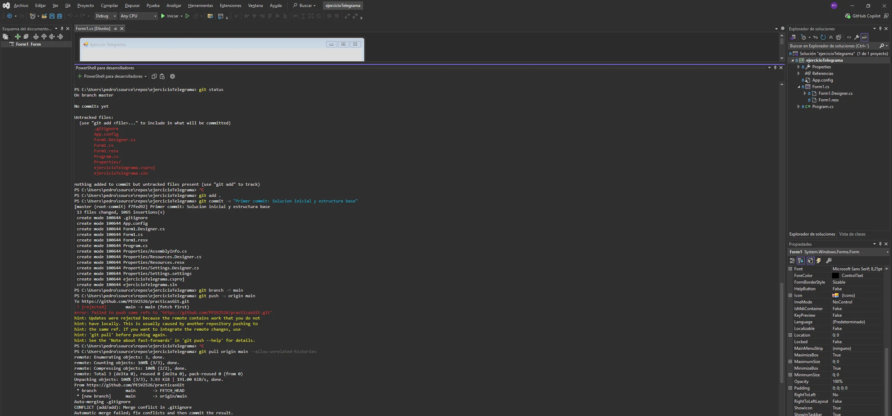
_Creación del commit inicial con los 13 archivos base correctamente
versionados_


**Incidencia 3: Conflicto de ramas divergentes y resolución de conflicto en .gitignore**

**1. Descripción del problema**

Al renombrar la rama local a main e intentar sincronizar mediante git push -u origin main,
GitHub rechazó la subida ([rejected] - non-fast-forward / fetch first). Al ejecutar
posteriormente un git pull para integrar los cambios remotos, Git arrojó un conflicto
explícito:

```
CONFLICT (add/add): Merge conflict in .gitignore
Automatic merge failed; fix conflicts and then commit the result.
```
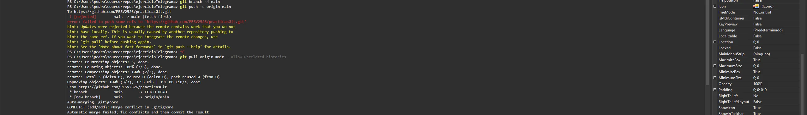
_Rechazo del git push y posterior fallo de merge automático con conflicto en
.gitignore_

**2. Causa técnica**

Al crear el repositorio en la interfaz web de GitHub se marcó la opción de generar un
archivo .gitignore, creándose un commit inicial remoto. Al no existir un ancestro común
con el commit creado en la máquina local, las dos historias eran divergentes (unrelated-
histories). Además, al existir un archivo .gitignore creado en remoto y otro creado en
local, se produjo una colisión add/add.

**3. Resolución aplicada**
    1. **Fusión de historiales no relacionados:** Se forzó la descarga e integración del
       historial remoto:
          _git pull origin main --allow-unrelated-histories_
    2. **Resolución del conflicto de fusión:** Para garantizar la compatibilidad con la
       solución de Visual Studio local, se forzó el uso de la versión local del .gitignore:
          _git checkout --ours .gitignore_


3. **Cierre de merge y subida final:** Se marcó el fichero como resuelto, se generó
    el commit de merge correspondiente y se publicaron los cambios en GitHub:
       _git add .gitignore
git commit -m "Merge con repositorio remoto resolviendo conflicto de gitignore"
git push -u origin main_

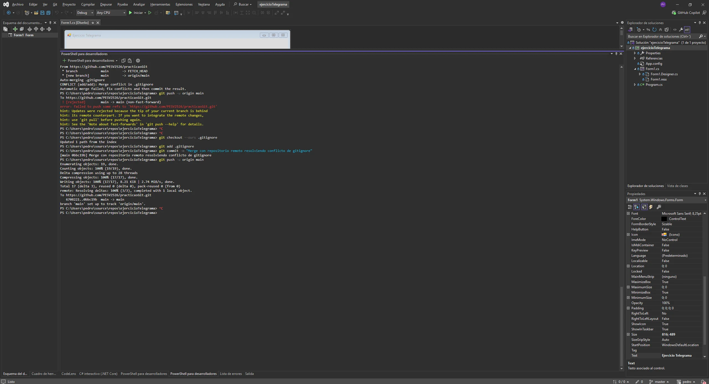
_Confirmación del git push exitoso con la rama main siguiendo a
origin/main_


**Usuario Colaborador PESV2526-colab**

**Incidencia 4: Conflicto de autenticación (Error 403) por caché en Administrador
de Credenciales de Windows**

**1. Descripción del problema**

Al intentar publicar la nueva rama remota feature-colab mediante el comando git push -u
origin feature-colab desde la cuenta secundaria, la operación fue abortada por el servidor
remoto con un código de error de permisos:

```
remote: Permission to PESV2526/practicasGit.git denied to pedroesimonv.
fatal: unable to access 'https://github.com/PESV2526/practicasGit/': The requested
URL returned error: 403
```
**2. Causa técnica**

El componente **Git Credential Manager** de Windows mantiene en caché las credenciales
HTTPS asociadas al host github.com. A pesar de haber configurado localmente la
identidad con git config para el usuario colaborador (PESV2526-colab), el sistema
operativo inyectó de forma transparente el token/sesión almacenado previamente en el
Administrador de Credenciales (pedroesimonv), una cuenta sin permisos de escritura
sobre el repositorio PESV2526/practicasGit.

**3. Resolución aplicada**
    1. **Purga de credenciales en el sistema operativo:**
       o Se accedió al **Panel de control > Administrador de credenciales >**
          **Credenciales de Windows**.
       o En el bloque de **Credenciales genéricas** , se localizó la entrada
          git:[https://github.com](https://github.com) y se procedió a su eliminación
          manual para forzar la reautenticación.
    2. **Reautenticación y subida de la rama:**
    o Se relanzó la orden de publicación de la rama:
       _git push -u origin feature-colab_


```
o En el cuadro de diálogo emergente de GitHub, se inició sesión explícitamente con
las credenciales de la cuenta colaboradora PESV2526-colab.
o El envío se completó satisfactoriamente, registrando la rama en el repositorio
remoto vinculada a la cuenta secundaria.
```
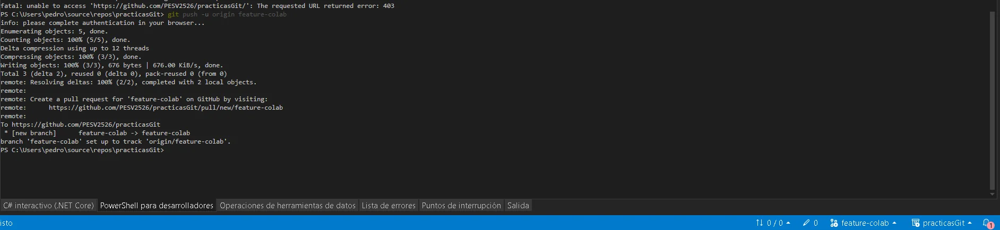
_Salida de PowerShell confirmando el push exitoso de feature-colab y su
visualización en GitHub_


**Procedimiento: Integración mediante Pull Request y sincronización descendente**

**1. Emisión de la solicitud de incorporación (Usuario Colaborador)**

Desde la interfaz de desarrollo en la máquina secundaria, se generó una _Pull Request_
desde la rama de trabajo feature-colab hacia la rama base main del repositorio central
(PESV2526/practicasGit), notificando la resolución de los errores lógicos del cálculo de
tarifas y procesamiento de texto.

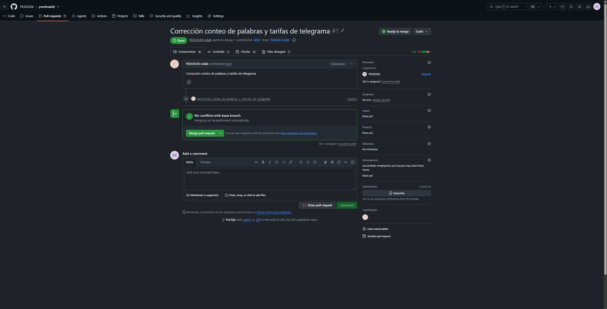
_Detalle de la Pull Request abierta en GitHub o Visual Studio con el diff de
código verde/rojo_

**2. Revisión y fusión remota (Usuario Administrador)**

Con la cuenta principal PESV2526, se procedió a la auditoría de los ficheros modificados
en la sección _Files changed_ de GitHub. Tras verificar la integridad del parche, se ejecutó
la fusión definitiva mediante la opción _Merge pull request_.

**3. Actualización del espacio de trabajo local**

Para reflejar el estado consolidado de la rama principal en el equipo local de desarrollo,
se ejecutó una sincronización por consola:

```
git checkout main
git pull origin main
```

Git aplicó una estrategia de actualización Fast-forward, alineando el puntero local con el
commit e8a83b0 de origin/main y modificando el fichero Form1.cs.


**Fase de desarrollo: Refactorización de interfaz (RadioButtons) y publicación en
rama principal**

**1. Descripción de la tarea**

Siguiendo los requisitos de la práctica (puntos 19 y 20), el **Usuario 1** (PESV2526) asumió
la tarea de rediseñar la entrada de datos para la modalidad del envío, sustituyendo el
control CheckBox binario (cbUrgente) por un grupo excluyente compuesto por dos
controles RadioButton: rbOrdinario y rbUrgente.

**2. Modificaciones técnicas implementadas**
    - **Capa de interfaz (Form1.Designer.cs):** Eliminación del componente cbUrgente,
       instanciación y posicionamiento en el contenedor de los controles rbOrdinario y
       rbUrgente, estableciendo la selección inicial por defecto en modo ordinario.
    - **Lógica de negocio (Form1.cs):** Adaptación del manejador de eventos
       button1_Click para evaluar mediante una estructura condicional alternativa el
       estado de la propiedad .Checked de ambos selectores antes de computar las tarifas
       correspondientes.
**3. Control de versiones y publicación**

Tras validar localmente la compilación y ejecución del proyecto en Visual Studio 2022,
se comprobó el estado de las modificaciones en PowerShell:

```
git status
```
El comando confirmó la alteración de los dos ficheros (Form1.Designer.cs y Form1.cs).
Acto seguido, se prepararon los cambios en el _staging area_ , se formalizó el commit y se
publicó el nuevo estado directamente sobre la rama remota de producción:

```
git add.
git commit -m "Sustituye CheckBox urgente por RadioButtons ordinario y urgente"
git push origin main
```

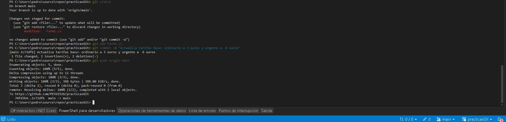
_Salida de PowerShell con la preparación del commit 70fd3b4 y el push
exitoso a origin/main_

**4. Verificación remota**

Se accedió a la interfaz web de GitHub en el repositorio PESV2526/practicasGit,
verificando que el árbol de commits de la rama main refleja la autoría del Usuario 1 con
el commit 70fd3b4, consolidando 43 adiciones y 25 eliminaciones.


**Fase final: Fusión local, actualización de tarifas y sincronización bidireccional**

**1. Fusión de rama de características en local (Usuario 2)**

Siguiendo las pautas de integración local (Paso 21), el Usuario 2 cambió el contexto a su
rama local main y ejecutó la fusión gráfica ( _merge_ ) de feature-colab para incorporar las
correcciones iniciales a su historial base.

**2. Actualización descendente desde remoto (Paso 22)**

Para integrar en la máquina secundaria el rediseño con RadioButton subido previamente
por el Usuario 1, se ejecutó una orden de sincronización por consola:

```
git checkout main
git pull origin main
```
El árbol de trabajo local del Usuario 2 se alineó con el commit remoto 70fd3b4.

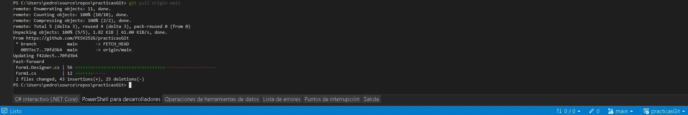
_Salida de PowerShell en el equipo secundario mostrando el git pull de los
RadioButtons_

**3. Ajuste de tarifas y publicación (Paso 23 - Usuario 2)**

El Usuario 2 modificó en Form1.cs las tarifas base para mensajes de hasta 10 palabras
(fijando 3 € para telegramas ordinarios y 6 € para urgentes). Verificada la compilación, se
emitió el commit y se publicó en el repositorio central:

```
git add Form1.cs
```

```
git commit -m "Actualiza tarifas base: ordinario a 3 euros y urgente a 6 euros"
git push origin main
```

**4. Cierre de sincronización (Usuario 1)**

En la estación de trabajo principal (PESV2526), se ejecutó la descarga final de los
cambios efectuados por la cuenta colaboradora:

```
git pull origin main
```
Git completó la actualización mediante Fast-forward, garantizando la paridad total del
código fuente en ambos extremos del desarrollo distribuido.

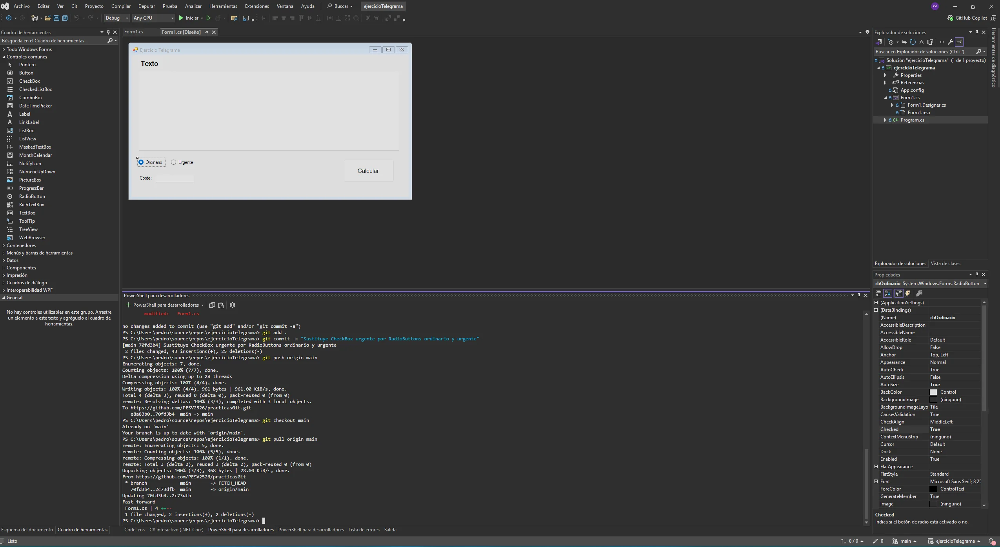
_Consola del Usuario 1 con el Fast-forward final confirmando la recepción
del último commit_


**Verificación y auditoría del historial (GitFlow y Etiquetado)**

**1. Implementación de GitFlow y Release**

Siguiendo los principios de **GitFlow** , se formalizó la arquitectura de ramas del
repositorio:

- **Rama develop:** Creada y publicada como eje troncal para el ciclo de desarrollo
    e integración continua.
- **Rama main:** Reservada para versiones consolidadas y listas para despliegue.
- **Etiquetado semántico (v1.0.0):** Se generó un tag anotado sobre el último
    commit de producción para marcar formalmente la entrega de la solución:
_git tag -a v1.0.0 -m "Release v1.0.0: Version final estable ejercicio telegrama"
git push origin v1.0._
**2. Inspección del árbol de commits**

Se auditó la topología completa del repositorio mediante el visor gráfico de consola:

```
git log --graph --oneline --decorate –all
```
Esta representación constata la bifurcación de la rama feature-colab, los commits
concurrentes de ambos desarrolladores, la resolución de fusiones y la convergencia final
etiquetada en main y reflejada en develop.

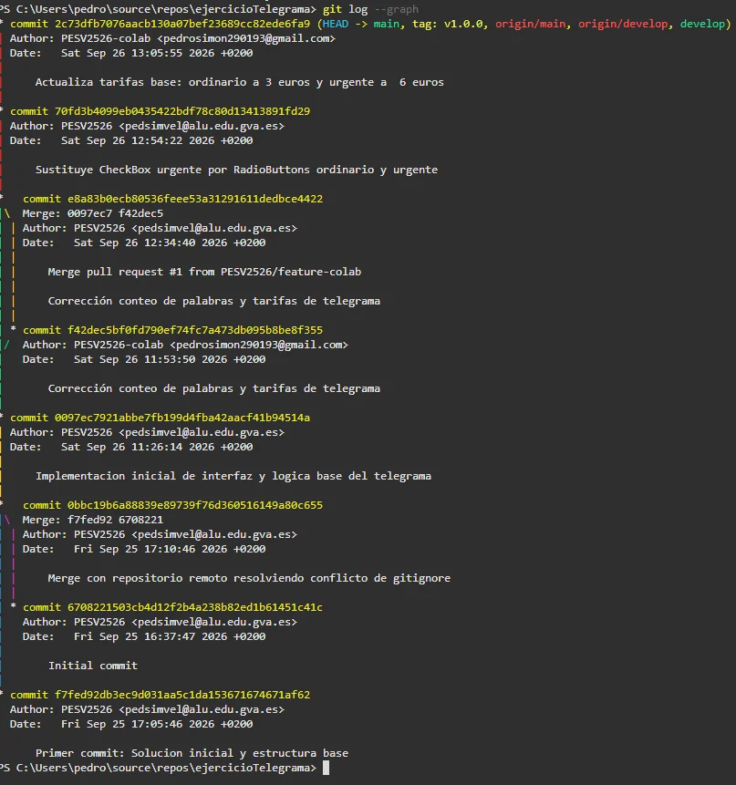
_Captura 13 : Salida del comando git log --graph en PowerShell_


